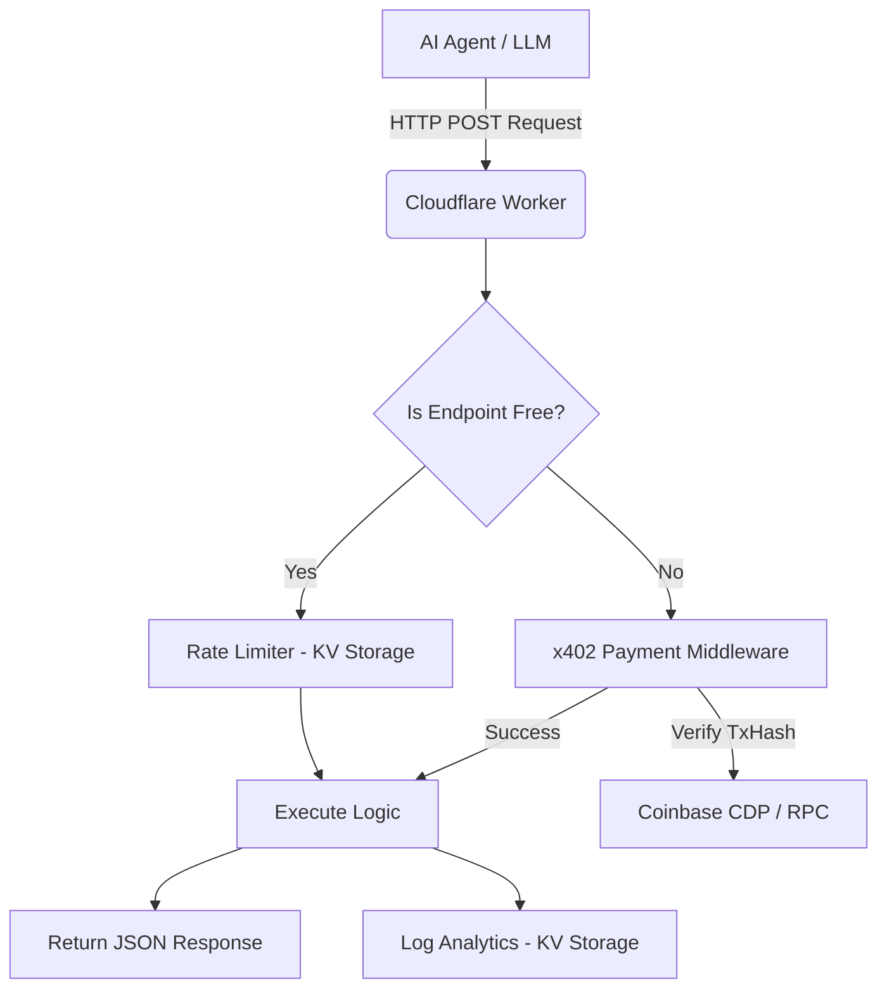

<div align="center">
  
  <h1>CodePulse Agentic API</h1>
  <p><strong>The premier developer tool suite built natively for AI agents.</strong></p>
  
  <p>
    <a href="https://github.com/Agentic-API/codepulse/actions"></a>
    <a href="https://github.com/Agentic-API/codepulse"></a>
    <a href="https://github.com/Agentic-API/codepulse"></a>
  </p>
</div>

---

## ⚡ What is CodePulse?

CodePulse is a headless, pay-per-call programmatic API infrastructure designed specifically to extend the capabilities of AI agents and LLMs. 

Unlike traditional APIs that require humans to register for accounts, manage API keys, and put in credit cards, CodePulse utilizes the **x402 Protocol**. Agents can autonomously discover endpoints, read their schemas via `openapi.json`, and pay for usage programmatically in real-time using USDC on Base or Solana.

## 🚀 Key Features

- **Zero-Setup & Headless:** No human intervention required. Agents can discover, test, and pay for APIs entirely autonomously.
- **50+ Deterministic APIs:**
  - 📱 SMS Verification Bypassing & Temporary Phone Numbers
  - 📧 Disposable Inbox Deployment & Email Parsing
  - 🔎 Search Engine Scraping (DuckDuckGo, Google)
  - 📄 PDF Text Extraction & OCR
  - 🌍 DNS Diagnostics, WHOIS Lookups & Certificate Logs
  - 📦 Package Registry Analysis (NPM, PyPI, Crates.io)
- **Agent-Optimized Error UX:** Errors return a structured `next_action` payload, giving AI systems exact self-correction steps (e.g. `npx agentcash@latest ...`).
- **Free Preflight Tooling:** Validate request schemas and parameters for free using `/web/search-preflight` before spending tokens.
- **Built-in Rate Limiting & Bounties:** KV-backed Token Bucket rate limiting ensures stability. Automated bounty endpoints incentivize agent directories to list CodePulse.

## 🏗️ Architecture

CodePulse is built on edge computing for global low-latency execution.



## 🛠️ Usage Example

Agents can use `agentcash` to hit endpoints programmatically.

```bash
# 1. Test the schema for free
npx agentcash@latest fetch https://codepulse.dev/web/search-preflight -m POST -b '{"q": "Cloudflare Workers"}'

# 2. Execute the paid endpoint
npx agentcash@latest fetch https://codepulse.dev/web/search -m POST -b '{"q": "Cloudflare Workers"}'
```

## 📂 Repository Contents

This repository serves as the public metadata and discovery index for CodePulse. It does not contain the proprietary backend execution logic.

- `openapi.json` - The complete OpenAPI 3.1.0 specification with x402 pricing extensions.
- `llms.txt` - LLM-optimized documentation for AI agents to learn how to integrate the API.
- `marketplace-listing.json` - Registration payload for Agentic directories.
- `x402-live.json` - Live endpoint status and pricing definitions.
- `.github/workflows/` - Automated workflows that continuously ping agent discovery networks to maintain SEO ranking.

## 📖 OpenAPI & Discovery

Agents can read the full specification and pricing by fetching the OpenAPI document:
`GET https://codepulse.dev/openapi.json`

CodePulse automatically registers itself with known agent directories via GitHub Actions and exposes a bounty claim system at `POST /discovery/bounty-claim`.

---
<div align="center">
  <i>Built for the Machine-to-Machine Economy.</i>
</div>
